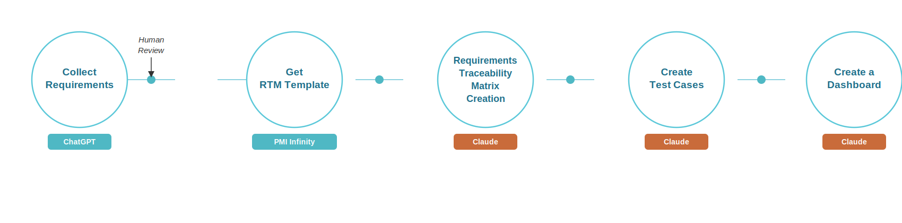

# From requirements to dashboard: an AI-assisted PM workflow

This document walks through how the requirements management artifacts in this
project were produced, from raw stakeholder input to a live-monitoring
dashboard. It's written so someone unfamiliar with the project can follow the
same workflow on their own requirements set.

Five stages, three tools: **ChatGPT** to draft the raw requirements inputs,
**PMI Infinity** for a standard RTM template, and **Claude** for everything
from turning those inputs into a structured, traceable requirements set
through to a monitoring dashboard.

---

## 1. Collect requirements — ChatGPT

**What happened:** ChatGPT was used to draft the raw project inputs for a
fictional case (the "Global Food Waste Reduction Network"): a project
charter, a project research-areas memo, a draft requirements document, and
three simulated stakeholder meeting transcripts covering data security,
integration risk, and user adoption.

**Output:** six source documents, saved into the `Development Approach and
Lifecycle` folder:

- `01. Project Charter.docx`
- `02. Project Research Areas.docx`
- `03.Project_Requirements_Document.pdf`
- `04.Requirements Team Meeting Transcript 1.docx`
- `05.Requirements Team Meeting Transcript 2.docx`
- `06.Requirements Team Meeting Transcript 3.docx`

## 2. Human review

Before moving into formal requirements management, the drafted documents were
reviewed for completeness and realism — checking that the charter's
objectives, the meeting transcripts, and the draft PRD were internally
consistent enough to analyze as if they were real project inputs.

## 3. Get RTM template — PMI Infinity

**What happened:** PMI Infinity was used to pull a standard Requirements
Traceability Matrix template, which defined the column set to build toward:
Requirement ID, Requirement Description, Source, Priority, Design
Specification, Development Status, Test Case ID, Test Status, and Comments.

**Output:** a target RTM structure — no file of its own, but it shaped the
prompt used in step 4.

## 4. Requirements traceability matrix creation — Claude

This stage had two parts: first turning the raw documents into an organized
requirements list, then formatting that list into the RTM.

**Prompt (paraphrased):** *"Review and analyze all the attached documentation
collected as part of requirements gathering. Make a list of all project
requirements and organize them according to requirement type."*

**Output:** `Requirements_Documentation_Global_Food_Waste_Reduction_Network.docx`
— every requirement found across the six source documents, organized using
the PMBOK taxonomy (Business, Stakeholder, Functional, Non-Functional,
Quality, Transition, Project), with each requirement traced back to the
document it came from.

**Prompt (paraphrased):** *"Organize the project requirements into a
Requirements Traceability Matrix, using the PMI Infinity column set
(Requirement ID, Description, Source, Priority, Design Specification,
Development Status, Test Case ID, Test Status, Comments)."*

**Output:** `RTM_Global_Food_Waste_Reduction_Network.xlsx` — one row per
requirement, color-coded by category and priority, with a Legend tab
explaining the ID scheme. As the project team reviewed the RTM and trimmed it
down to the requirements they actually needed, the requirements document was
regenerated from the updated RTM so the two files stayed in sync.

## 5. Create test cases — Claude

**Prompt (paraphrased):** *"Write user test cases for the items in the RTM,
and verify that those scenarios match the RTM."*

**Output:** a `Test Cases` tab added to the same workbook — one scenario per
requirement (preconditions, steps, expected result), plus a `Traceability
Verification` tab documenting the integrity check: every Test Case ID cross-
referenced against its Requirement ID, mismatches corrected, and a duplicate
requirement (two rows with identical text) flagged and later resolved.

This is also the point where the RTM started reflecting real project
progress — Development Status and Test Status values were updated as work
moved from Not Started to In Progress to Done, and the workbook was kept
consistent as that happened.

## 6. Create a dashboard — Claude

**Prompt (paraphrased):** *"Create a dashboard-type visualization of the
test cases"* → *"What would you suggest including in an RTM monitoring
dashboard?"* → *"Include those and create an HTML file I can host on
GitHub."*

**Output:** `rtm_dashboard.html` — a single, self-contained file (Chart.js
loaded from a CDN, no build step) covering:

- coverage and progress KPIs (requirements, test case coverage, development
  and testing progress)
- development and test status breakdowns
- requirement mix by category and priority
- an at-risk list (high-priority requirements with development not started)
- a traceability integrity panel (open/resolved issues)
- a changelog tracking how the RTM's scope and status have changed over time

Because it's a static snapshot, updating it later means regenerating the data
in the script from the current RTM — the same way it was first built.

---

## Applying this to your own project

1. Gather your requirements inputs (charter, meeting notes, existing specs)
   however you normally would.
2. Pick (or build) an RTM template with the columns your team actually needs.
3. Have an AI assistant read all your source documents at once and produce a
   categorized requirements list — this catches things buried in meeting
   transcripts that are easy to miss by hand.
4. Turn that list into the RTM, and treat the RTM as the source of truth —
   regenerate downstream documents (requirements doc, test cases, dashboard)
   from it rather than editing them independently.
5. Add test cases per requirement, and verify traceability (every requirement
   has exactly one test case, every test case maps back to a real
   requirement) — this is the step most likely to have silent errors.
6. Build a monitoring view once the RTM is stable enough that you'll want to
   check on it repeatedly, not before.
